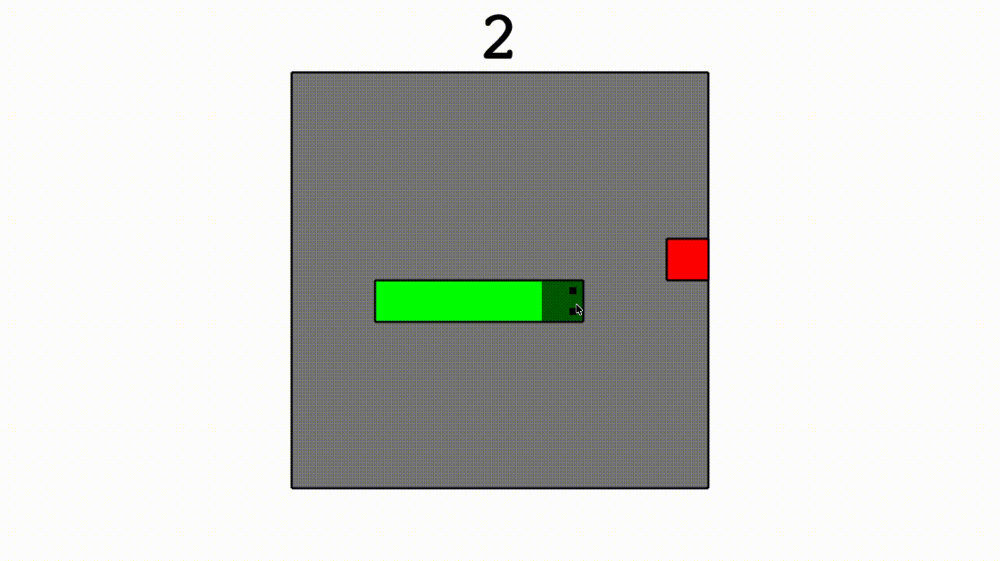

# TINY SNAKE
tiny snake is a simple snake game made in javascript. It fits in a single url thats below 3kb. 

## HOW TO RUN
1. open [url.txt](url.txt)
2. copy the url
3. paste it into the address bar of your browser and click enter
4. enjoy!

## HOW TO PLAY
- use WASD to move
- avoid hitting the edges or your own body
- get as many apples as possible
- press any key to reset after death

## FEATURES
- entire game contained in a single URL
- no external libraries/assets
- runs directly in the browser
- score tracking
- moving snake
- collision detection 
- fits within 3KB

## SIZE
2.91/3KB